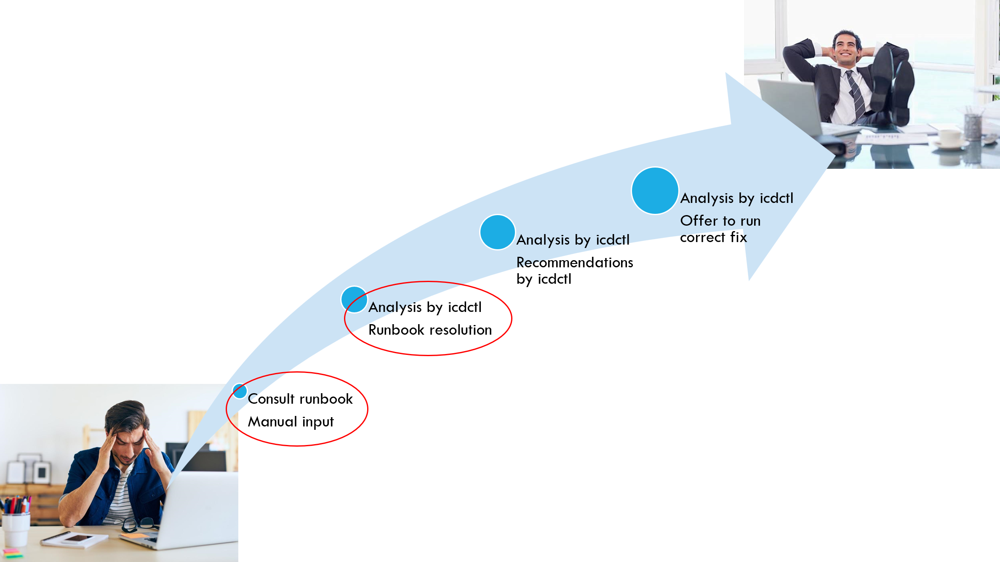

During my internship at IBM Cloud, I worked on improving the operational efficiency of Elasticsearch databases. My main task was to enhance a command-line tool for managing IBM Cloud databases to automate the diagnosis of unassigned database partitions, identifies root causes, and presents actionable insights. Previously, shard assignment failures resulted in generic errors, requiring engineers to investigate manually. My contribution helped shift from this time-consuming troubleshooting process to a more efficient, semi-automated diagnostic workflow.

# Technological Context

**IBM Cloud** provides a robust platform for deploying, managing, and scaling cloud applications. It supports a variety of database solutions, including Elasticsearch, which is widely used for search and analytics.

**Elasticsearch** is a distributed search engine that uses a **sharding mechanism to distribute data across multiple nodes** for better scalability and fault tolerance. Sharding ensures that large datasets can be efficiently indexed and queried. However, shard assignment issues can arise due to insufficient resources, misconfigurations, or node failures, requiring effective troubleshooting.

# Developing the right tools

A key focus of my internship was bringing automation to shard assignment analysis within IBM Cloud. I worked on integrating ``icdctl`` (**IBM Cloud Database Control**) with enhanced diagnostic capabilities, specifically implementing ``eseu`` (**Elasticsearch Explain Unassigned**) to analyze Elasticsearch error states. 

For example, if a shard remained unassigned due to insufficient disk space on a node, ``eseu`` would analyze the system, detect the issue, and provide a clear diagnostic message, enabling engineers to take swift corrective action.

The image below illustrates the progression from manual shard assignment analysis to full automation, showing how troubleshooting and resolution workflows evolved:

My task primarily focused on advancing automation from the first to the second stage. I did this by:
- Enhancing the ``icdctl`` command-line tool for terminal-based database management.
- Designing and implementing the ``eseu`` command within ``icdctl`` to automate diagnosing unassigned shards.
- Ensuring the ``eseu`` command provided detailed and actionable explanations for unassigned shards, improving the troubleshooting workflow for database administrators.
- Enhancing error reporting to provide more informative feedback instead of generic failure messages.
- Improving overall troubleshooting efficiency for database administrators and engineers.

# Conclusion
Working on this project provided valuable hands-on experience with Elasticsearch and IBM Cloud database solutions. It also deepened my understanding of automation in cloud infrastructure. One of the most challenging aspects involved diagnosing shard assignment failures, which required a detailed grasp of Elasticsearch internals. Ensuring both accuracy and usability in automation was another key consideration.

Although my contribution was a small part of a larger system, it had a meaningful impact. Engineers gained a clearer method for identifying and understanding shard assignment issues, which reduced the time spent on manual troubleshooting. By streamlining this process, the automation helped improve overall debugging efficiency.
