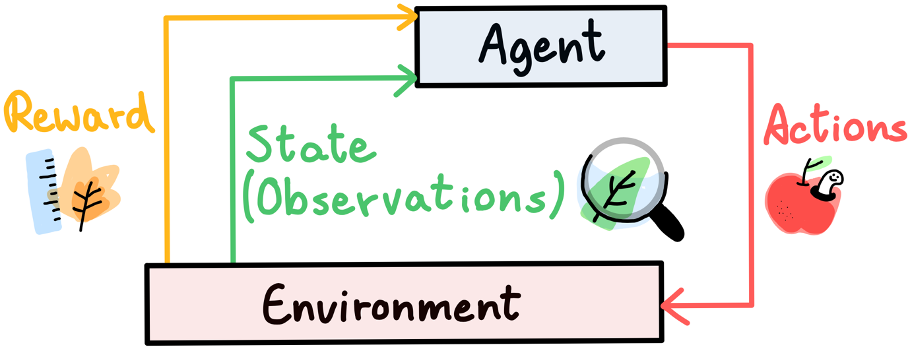
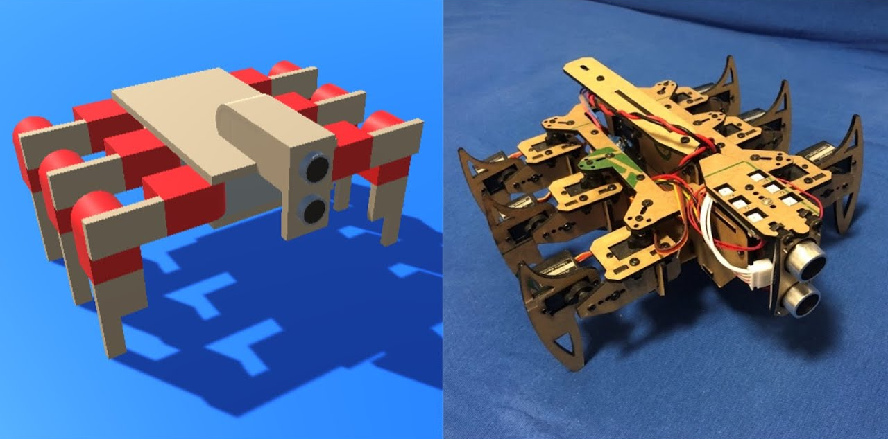
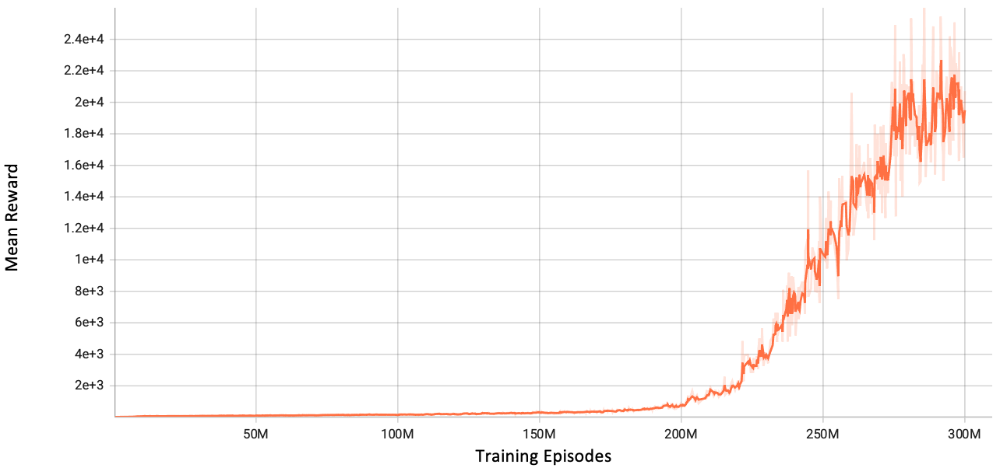
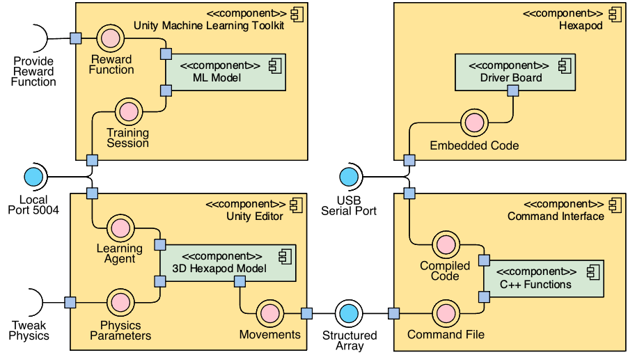

Welcome to the world of AI robotics. My 5th semester computer science research project joins open-source machine learning tools and accessible robotics hardware to develop a movement system for a six-legged robot - a blend of cutting-edge algorithms and real-world applicability.

Machine learning lies at the core of this endeavor, driving optimization and progress across various industries. Here, we focus on reinforcement learning, a method that leverages evolutionary principles to refine algorithms through iterative improvement. Unlike conventional approaches, this paradigm offers a cost-effective solution to address practical challenges. Simultaneously, robotics has witnessed significant advancements, with specialized machines assuming roles traditionally held by human workers. From factory floors to logistics operations, robots have become indispensable assets. This project serves as a bridge between these dynamic fields, aiming to seamlessly integrate machine learning's capabilities with the practicality of robotics, pushing the boundaries of innovation. Join us as we explore the potential unleashed by this fusion of transformative technologies.

# Table of contents
1. [**What is reinforcement learning**](#what-is-reinforcement-learning)
2. [**Hardware - meet ASTERISK the robot**](#hardware---meet-asterisk-the-robot)
3. [**Simulation - learning to walk**](#simulation---learning-to-walk)
4. [**Bringing it all together: the sim-reality-gap**](#bringing-it-all-together-the-sim-reality-gap)
5. [**Summary**](#summary)
6. [**Links & Downloads**](#links--downloads)

# 1. What is reinforcement learning

In the vast landscape of applications, Machine Learning (ML) stands out for its ability to predict behaviors, such as stock market movements or online shopping patterns. It's a versatile tool that's revolutionizing various fields including science, economics, health services, and logistics.

One of the landmark moments showcasing the power of ML was DeepMind's AlphaGo defeating a three-time European Go Champion in 2015. What set AlphaGo apart was its utilization of Reinforcement Learning (RL), a technique where computers learn through trial-and-error rather than relying on human-crafted algorithms. This approach led AlphaGo to discover innovative strategies that hadn't been explored in the thousands of years of the game's history.

So, how does RL work? Imagine a simple feedback loop: the agent observes the state, makes a decision, executes an action, and receives feedback in the form of a reward. This feedback loop, illustrated in the figure below, mimics a simulated survival of the fittest scenario. 

{: width="1200" height="900"}

Through multiple generations of agents competing against each other, the system rewards good behavior while penalizing poor performance. The best algorithms evolve and adapt, honing their skills to navigate the environment effectively.

# 2. Hardware - meet ASTERISK the robot

The robot in this research project is an [Adeept Hexapod Spider Robot kit](https://www.amazon.de/-/en/Hexapod-Compatible-Crawling-Self-Stabilising-Robotics/dp/B086HJJWGV/ref=sr_1_4?crid=3UDJQE41QQNPT&dib=eyJ2IjoiMSJ9.-1CavwfoLD3q877HAL6CM0xVtxTHGNOap_0BZf8RZhFOCD0b23VpSz7mbW-6eZbWUNk-g0_UnediNz9_hM9GGDBYuBtcqb31Oqt11YUNskReoU5pIPOqsBt-Z9Zy4-Rv4c7RafrAUcssPNdPh30y7MShuh2xwKzu1IKc1G9guww9F6Hd_RMIlu9wFQXfQ1erHsgjE8KIVjtoT4hquOgqngZ9YpYWARmVI4z2XkwK9vbCnvbCcgTOR1SPFWzUIR2KqY--cXWNAv-lntnc8BCL6NrK34lOcnTYjhif2ds4d8o.T2uD2LMWCyGPJcr-1iqSB6Je6AJJ8ZO5HJzWZo7hvtc&dib_tag=se&keywords=adeept+hexapod&qid=1711676977&sprefix=adeept+hexapod%2Caps%2C163&sr=8-4). The assembled robot consists of the following parts and subsystems:
- 13 servo motors, two for each leg and one for the robot’s head,
- an LED module with 6 RGB LEDs,
- an ultrasonic distance sensor,
- a WiFi module for remote control,
- a six-axis motion tracking gyroscope and accelerometer,
- an Arduino-based AdeeptPixie driver board, connecting all the components, and finally,
- polymer, laser-cut body parts, and frame.

{: width="1200" height="900"}

I named it ASTERISK (Adeept Six-legged Terrestrial Robot Kit) because with it's 6 legs it looks like, well, an asterisk * from above. 

# 3. Simulation - learning to walk

The **Unity Machine Learning Agents Toolkit** is a groundbreaking platform that harnesses the capabilities of the Unity game engine to revolutionize reinforcement learning. By seamlessly integrating with PyTorch, an open-source ML framework, the toolkit allows developers to train intelligent agents within 3D simulations. 

In my project, I used Unity's game engine to construct a lifelike 3D model of my robot, facilitating a comprehensive environment for simulation and training. Unity's interface and robust features make it a one-stop-shop for both creating virtual worlds and training ML models, which offered convenience and efficiency in the development process. You can see the result of my model, compared to it's real counterpart right here:

{: width="1200" height="900"}

In developing the 3D model for my robot within Unity's game engine, I opted for an abstraction that prioritized functionality over strict visual fidelity. Rather than aiming for a one-to-one replication of the physical robot, the 3D model focuses on capturing essential elements crucial for training a walking algorithm. Specifically, the model emphasizes the degrees of freedom necessary to simulate the robot's servo motors (colored in red). I will spare you the details of the Unity setup, you can read all about it in the actual document linked at the end of this page.

After approximately 12 days of training, the simulation hit a significant milestone, reaching the 300 million episodes mark. Below you can see the training graph depicting the mean reward over the entire duration. A striking observation arises: at episode 200 million, the training records a massive increase in mean rewards for the ML agents.

{: width="1200" height="900"}

A striking observation arises: the training records a massive increase in mean rewards for the ML agents, soaring by over 2000% between episodes 200 million and 280 million. This substantial increase reaches a local maximum around the 280 million mark, indicating diminishing returns in further training efforts. With training times and project deadlines looming, this plateau presented a fine moment to halt the training.

# 4. Bringing it all together: the sim-reality-gap

The data flow architecture comprises four interconnected components: 

Firstly, the Unity Machine Learning Toolkit orchestrates the training session, integrating the reward function to guide the learning process. Secondly, within the Unity Editor, the learning agent interacts with physics parameters and movement dynamics, refining its behavior. Unity communicates through a structured array with the third component, the command interface, which compiles recorded movements using C++, enhancing the agent's training with real-world data. Finally, leveraging a USB port, the compiled data is uploaded to the robot, empowering it with the learned behaviors from the training session.

Even though we worked hard to make the robot learn well in the computer simulation, making it move in real life is much trickier. The movements that looked good in the simulation don't always work out the same way in real life. This happens because the simulation and real world are not exactly the same. Things like how joints move and how servos work can be different. To fix this, we would need to adjust the simulation to be more like the real world and find ways to help the robot learn from its mistakes. If only we had unlimited time to create the matrix and simulate reality... either way, I invite you to watch the simulation simulate, and the robot being a dork in the accompagning online video:

[Watch the simulation on YouTube!](https://youtu.be/PUKM7EDM2GM)

# 5. Summary

In conclusion, the project successfully completed the proposed architecture by creating a 3D model resembling Adeept's robot and training it to navigate along a straight path. Despite encountering delays, the research progressed smoothly as each main topic was developed independently. However, the most significant challenge arose from the disparity between simulation and reality. 

While the ML model became proficient in walking through weeks of training, this efficiency did not translate to the physical robot due to differences in physics representation and sensor capabilities. To bridge this gap, future endeavors should focus on fine-tuning simulation parameters to better resemble real-world conditions and incorporating the robot's behavior into the training feedback loop. Overall, addressing the discrepancy between simulation and reality is crucial for harnessing the full potential of reinforcement learning in physical applications.

# 6. Links & Downloads

<a href="https://youtu.be/PUKM7EDM2GM" class="ctn-button c-button c-button--primary c-button--small">
  Watch the simulation on YouTube
</a>

<a href="../../files/Development of a movement system for a six-legged robot based on Machine Learning.pdf" 
    class="ctn-button c-button c-button--primary c-button--small" download>
  Download Student Research Project
</a>

<a href="https://www.icloud.com/iclouddrive/0ccFXSrV7GMuCw-UZ-N66yzLA#Appendix" class="ctn-button c-button c-button--primary c-button--small" download>
  Download Appendix
</a>
